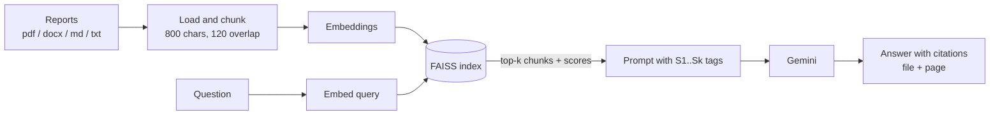

# RAG Analytics Assistant for Business Reports

Ask questions of a folder of business reports and get answers that cite the passage, file and page
they came from. Reports in PDF, Word, Markdown or text are chunked, embedded into a FAISS index and
retrieved for a Gemini model, which is instructed to answer only from those excerpts and to say so
when the reports do not contain the answer.


> **Q:** What drove the revenue growth in Q3?
> **A:** Cloud Analytics subscriptions grew 24% year on year, offsetting a 9% decline in legacy
> on-premise licences **[S1]**. ARR reached $182M with 114% net revenue retention **[S1]**.
> *(S1: 2024_Q3_financial_review.md)*

## How it works



1. **Ingestion** (`ingestion.py`): loads each file, records its source and page number (for PDFs),
   and splits it with LangChain's `RecursiveCharacterTextSplitter`.
2. **Embeddings** (`embeddings.py`): sentence-transformers `all-MiniLM-L6-v2` locally, or Gemini
   `text-embedding-004` / OpenAI through the API.
3. **Vector store** (`vectorstore.py`): a FAISS index saved to `data/index/` and reloaded on start.
4. **Prompting** (`prompts.py`): the top-k chunks are tagged `[S1]..[Sk]`; the prompt requires
   every claim to cite a tag, forbids outside knowledge, and defines the exact wording to use when
   the answer is not in the reports.
5. **Generation** (`llm.py`): Gemini (`gemini-2.0-flash` by default), with OpenAI or a local
   `flan-t5-base` as alternatives.
6. **Evaluation** (`evaluation.py`): scores retrieval and grounding on a labelled question set.

### Backends

The `auto` setting picks the best backend available, so the same code runs with or without keys:

| Order | Generation | Embeddings | Enable with |
|---|---|---|---|
| 1 | Gemini | Gemini `text-embedding-004` | `GOOGLE_API_KEY` + `requirements-api.txt` |
| 2 | OpenAI | OpenAI embeddings | `OPENAI_API_KEY` + `requirements-api.txt` |
| 3 | Local `flan-t5-base` | sentence-transformers | `requirements-llm.txt` |
| 4 | Extractive summariser (TF-IDF sentence ranking) | Hashing vectoriser | nothing extra |

The extractive tier needs no model or key: it ranks the sentences in the retrieved chunks against
the question and returns the best ones with their citations. It is useful for tests and offline
demos; the API tiers give fluent answers.

## Evaluation

`eval/eval_dataset.json` holds questions with the report each answer should come from, plus one
question the reports cannot answer.

```bash
python scripts/evaluate.py       # writes eval/results.json and eval/results.csv
```

| Metric | Meaning |
|---|---|
| recall@k | Share of questions where the expected report is among the retrieved chunks |
| groundedness | Share of answer sentences that closely match a retrieved chunk (a faithfulness check) |
| answer relevance | Cosine similarity between question and answer |
| abstention rate | How often the assistant correctly declines when the answer is not in the reports |

## Run it

```bash
pip install -r requirements.txt            # core
pip install -r requirements-api.txt        # Gemini / OpenAI
cp .env.example .env                       # add GOOGLE_API_KEY

python scripts/generate_sample_reports.py  # seven synthetic reports (finance, HR, sales, ...)
python scripts/ingest.py                   # build the index
python scripts/query.py "Which marketing channel had the best ROI?"
streamlit run app.py                       # chat UI with sources and page numbers
pytest -q                                  # unit tests (offline)
```

The Streamlit app shows the active backends, lets you upload your own reports and rebuild the
index, and lists every cited chunk with its file, page and similarity score. `make help` lists the
same commands.

## Project structure

```text
app.py                      Streamlit UI
config.yaml                 chunking, k, models and providers (env vars override)
src/rag_assistant/
    config.py               config dataclasses, yaml and env loading
    ingestion.py            loaders and chunking
    embeddings.py           embedding backends
    vectorstore.py          FAISS build, save, load
    prompts.py              citation prompt and context formatting
    llm.py                  generation backends
    pipeline.py             RAGPipeline: build_index() and query()
    evaluation.py           recall@k, groundedness, relevance, abstention
scripts/                    generate_sample_reports, ingest, query, evaluate
eval/eval_dataset.json      labelled questions
tests/                      pytest suite (ingestion, embeddings, pipeline, evaluation)
notebooks/walkthrough.ipynb step-by-step run
```

## Configuration

Settings live in `config.yaml`; these environment variables override them:

```text
RAG_LLM_PROVIDER=auto|gemini|openai|huggingface|extractive
RAG_EMBEDDINGS_PROVIDER=auto|huggingface|gemini|openai|hashing
RAG_LLM_MODEL=gemini-2.0-flash
GOOGLE_API_KEY=...
OPENAI_API_KEY=...
```

## Limitations and next steps

- The sample reports are synthetic; answer quality on long scanned PDFs depends on the text layer.
- Hashing embeddings are lexical, not semantic, and are meant for offline use only.
- Next: a cross-encoder re-ranker after retrieval, RAGAS for model-judged faithfulness, and
  conversation memory for follow-up questions.

## License

MIT. The sample reports are fictional.
