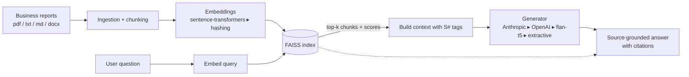

# 📊 RAG Analytics Assistant for Business Reports

A GenAI assistant that uses **retrieval-augmented generation (RAG)** to answer questions about a corpus of business reports and return **source-grounded summaries** — every answer cites the exact report excerpts it came from, so nothing is taken on faith.

Built with **LangChain + FAISS**, a **Streamlit** chat UI, and a deliberately **local-first** design: it runs end-to-end for **free and offline** out of the box, and transparently upgrades to a local LLM or a cloud API (OpenAI / Anthropic) when you make one available.

> Example: *"What drove the revenue growth in Q3?"* →
> *"Cloud Analytics subscriptions grew 24% YoY, offsetting a 9% decline in legacy on-premise licenses **[S1]**. ARR reached $182M with 114% net revenue retention **[S1]**."* — with the cited excerpt one click away.

---

## Why this project is interesting

- **Source-grounded, not hallucinated.** The model is instructed to answer *only* from retrieved excerpts, cite them as `[S1]…[Sk]`, and explicitly abstain ("I could not find this in the provided reports") when the corpus doesn't contain the answer.
- **Graceful degradation.** A 3-tier backend cascade means the project *always runs* — no "but I don't have an API key" failure mode that kills most demos.
- **Honest evaluation.** Ships with an offline eval harness measuring retrieval recall, a groundedness/faithfulness proxy, answer relevance, and abstention rate.
- **Clean, modular code.** Ingestion, embeddings, vector store, generation, and evaluation are cleanly separated and unit-tested.

---

## Architecture

```
                 ┌─────────────┐   chunk    ┌───────────────┐   embed    ┌──────────────┐
  reports/  ───▶ │  Ingestion  │ ─────────▶ │ Text Splitter │ ─────────▶ │  Embeddings  │
 (pdf/txt/       │  (loaders)  │            │ (recursive)   │            │ ST | hashing │
  md/docx)       └─────────────┘            └───────────────┘            └──────┬───────┘
                                                                                │
                                                                                ▼
   question ─▶ embed ─▶ ┌─────────────────┐  top-k chunks  ┌──────────────┐  prompt   ┌────────────┐
                        │  FAISS retriever │ ─────────────▶ │  Context +   │ ────────▶ │ Generator  │
                        └─────────────────┘   + scores      │  [S#] tags   │           │ API|HF|ext │
                                                            └──────────────┘           └─────┬──────┘
                                                                                             ▼
                                                              source-grounded answer + cited sources
```

The same flow as a diagram:



---

## Quickstart

```bash
# 1. install the free, offline core (no API key, no model download needed)
pip install -r requirements.txt

# 2. create the sample reports and build the index
python scripts/generate_sample_reports.py
python scripts/ingest.py

# 3a. ask from the command line …
python scripts/query.py "Which marketing channel had the best ROI?"

# 3b. … or launch the web app
streamlit run app.py
```

That's it — it now answers questions using local hashing-based retrieval and an extractive, citation-aware summariser. To make answers richer, opt into a better backend below.

---

## Backends (graceful degradation)

The pipeline picks the best **available** backend automatically (`provider: auto`). You opt in simply by installing extras or setting a key — no code changes.

| Tier | Generation | Embeddings | How to enable | Cost |
|------|------------|------------|---------------|------|
| **Cloud API** | Anthropic Claude / OpenAI GPT | OpenAI (optional) | `pip install -r requirements-api.txt` + set `ANTHROPIC_API_KEY` / `OPENAI_API_KEY` in `.env` | API credits |
| **Local model** | `google/flan-t5-base` (CPU) | `all-MiniLM-L6-v2` | `pip install -r requirements-llm.txt` | Free (one-time model download) |
| **Offline fallback** *(default)* | Extractive summariser (TF-IDF sentence ranking) | sklearn hashing vectorizer | nothing — works after `requirements.txt` | Free, no downloads |

Selection order for `auto`: **Anthropic → OpenAI → local flan-t5 → extractive**. Force a specific one via `config.yaml` or `RAG_LLM_PROVIDER` / `RAG_EMBEDDINGS_PROVIDER`.

---

## How it works

1. **Ingestion** (`ingestion.py`) — loads `.pdf/.txt/.md/.docx`, tags each section with its `source` (and `page` for PDFs), and splits text into overlapping chunks with `RecursiveCharacterTextSplitter`.
2. **Embeddings** (`embeddings.py`) — turns chunks into vectors. Uses sentence-transformers if installed, else a dependency-free hashing vectorizer that implements the LangChain `Embeddings` interface.
3. **Vector store** (`vectorstore.py`) — a FAISS index, persisted to `data/index/` and reloaded on demand.
4. **Retrieval + prompt** (`prompts.py`) — fetches the top-`k` chunks with similarity scores, labels them `[S1]…[Sk]`, and assembles a strict, citation-enforcing prompt.
5. **Generation** (`llm.py`) — an API/local LLM writes the grounded answer, or the extractive engine stitches the most relevant cited sentences together when no model is present.
6. **Evaluation** (`evaluation.py`) — scores retrieval and grounding offline (details below).

---

## Project structure

```
RAG_Analytics_Assistant/
├── app.py                       # Streamlit UI
├── config.yaml                  # central configuration
├── requirements*.txt            # core / -llm / -api dependency tiers
├── src/rag_assistant/
│   ├── config.py                # dataclass config + yaml/env loading
│   ├── ingestion.py             # load + chunk documents
│   ├── embeddings.py            # ST embeddings + hashing fallback
│   ├── vectorstore.py           # FAISS build/save/load
│   ├── prompts.py               # source-grounded prompt + context formatting
│   ├── llm.py                   # backend cascade + extractive generator
│   ├── pipeline.py              # end-to-end RAGPipeline
│   └── evaluation.py            # offline RAG metrics
├── scripts/                     # generate_sample_reports / ingest / query / evaluate
├── eval/eval_dataset.json       # Q&A with expected sources (incl. an unanswerable one)
├── tests/                       # pytest suite (offline, deterministic)
└── notebooks/walkthrough.ipynb  # step-by-step pipeline demo
```

---

## Evaluation

```bash
python scripts/evaluate.py        # writes eval/results.json and eval/results.csv
```

Metrics (all computed locally with the active embedding model — no LLM-as-judge required):

- **recall@k** — did retrieval surface the *expected* source document for each question?
- **groundedness** — fraction of answer sentences semantically close to a retrieved chunk (a faithfulness proxy).
- **answer_relevance** — cosine similarity between the question and the answer.
- **abstention_rate** — how often the assistant correctly declines when the answer isn't in the corpus (the eval set includes an unanswerable question to test this).

Quality scales with the backend: the offline fallback is intended to prove the *plumbing* is correct; sentence-transformers + an LLM materially improve groundedness and relevance.

---

## Configuration

Everything lives in `config.yaml` (chunk size, `k`, models, providers). A few switches can be overridden by environment variables (see `.env.example`):

```
RAG_LLM_PROVIDER=auto|anthropic|openai|huggingface|extractive
RAG_EMBEDDINGS_PROVIDER=auto|huggingface|openai|hashing
ANTHROPIC_API_KEY=...        # optional
OPENAI_API_KEY=...           # optional
```

---

## Extending it

- Swap in **RAGAS** for LLM-judged faithfulness/answer-correctness.
- Add a **cross-encoder reranker** after FAISS retrieval for sharper top-k.
- Add loaders (HTML, CSV, XLSX) or a different vector store (Chroma, pgvector).
- Add **conversational memory** for multi-turn follow-ups.

## Limitations

- The offline extractive backend summarises by selecting sentences, so it reads less fluently than an LLM — it's the floor, not the ceiling.
- Hashing embeddings are lexical, not semantic; install `requirements-llm.txt` for real semantic retrieval.
- The sample reports are synthetic and fictional.

## Skills demonstrated

RAG architecture · LangChain · vector search (FAISS) · embeddings · prompt engineering for grounding/citations · graceful fallback design · evaluation of LLM systems · Streamlit · clean Python packaging & tests.

## License

MIT — sample data is synthetic and free to use.
